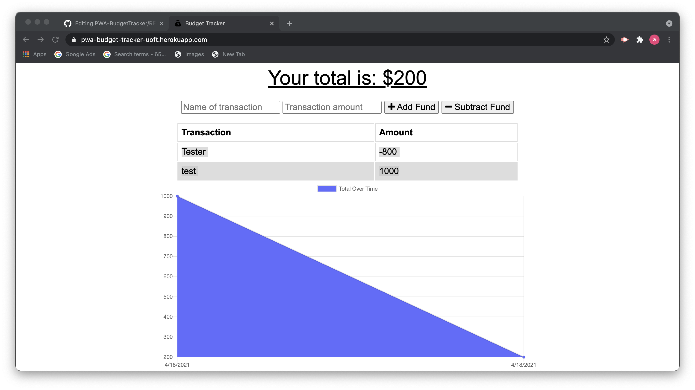

<h1 align="center">PWA - Budget Tracker</h1>
  
 

## Description
Track your expenditures easily with the Budget Tracker App, make your changes online or offline! Also, set the app to your devices homescreen!

## Table of Contents
- [Description](#description)
- [Installation](#installation)
- [Usage](#usage)
- [Screenshot](#screenshot)
- [Deployed](#deployed)
- [License](#license)
- [Contributing](#contributing)
- [Testing](#testing)
- [Questions](#questions)
- [Contact](#contact)

## Installation
> execute in terminal: npm install 
> execute in terminal: npm start 
> Or, visit our deployed Heroku link. 

## Usage
Simply enter the name of your expense, the amount and whether it is a debit or a credit and the app does the rest of the work for you!
## Screenshot

## Deployed
https://pwa-budget-tracker-uoft.herokuapp.com/

## License

 
This application is covered by the MIT license. 

## Contributing
Visit our repository and request access to contribute.

## Testing
Tested on macOS Big Sur

## Questions
Report any discovered issues here: issues@adlsoftware.com 
 

## Contact
Find me on GitHub: [Alovatt83](https://github.com/Alovatt83) 
 
Call me @: (905) 555-7295
 
Email me with any questions: allenlovatt@gmail.com  

This ReadMe Generator Was Made by [ADL Software Solutions](https://github.com/alovatt83/ReadMe-Generator)
